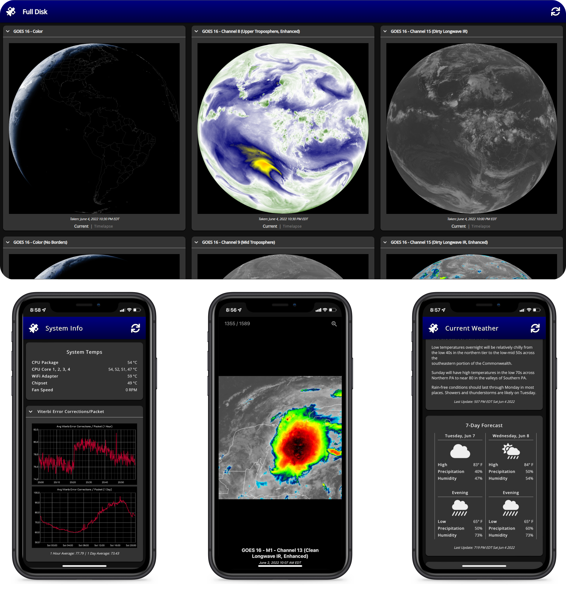
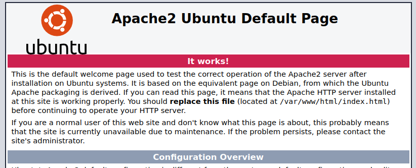

# Vitality GOES
A Web App for showcasing Geostationary Weather Satellite Data. The software is designed to display text and images received from GOES satellites via goestools.

**[Click here to watch a feature overview on YouTube](https://www.youtube.com/watch?v=o5ISR0bBFo0)**



### Table of Contents
1. [What does Vitality GOES do?](#what-does-vitality-goes-do)
2. [System Requirements](#system-requirements)
3. [Preparing your system for Vitality GOES](#preparing-your-system-for-vitality-goes)
4. [Installing Vitality GOES](#installing-vitality-goes)
5. [Configuring Vitality GOES](#configuring-vitality-goes)
6. [Updating Vitality GOES](#updating-vitality-goes)
7. [Additional Scripts](#additional-scripts)
8. [Other Tidbits](#other-tidbits)
9. [Credits](#credits)
10. [Additional Resources](#additional-resources)

## What does Vitality GOES do?

Vitality GOES makes data from the GOES HRIT/EMWIN feed easily accessible, through a web browser, from anywhere on your local network. Even if the internet goes down, people on your local LAN can still access real-time weather information.

Vitality GOES has the following features:

* Once set up by the ground station technician (you!), Vitality GOES is easily usable by anyone with no knowledge of radio, satellites, or programming.
* It presents all full-disk, Level 2 products, and mesoscale imagery in a user friendly and easily navigatable way.
* Pertinent EMWIN data (which includes current weather conditions, forecasts, watches, and warnings) are presented to the user in a way that is appealing and easy to read. There is no need to parse through data for other locations: your configured location's data is the only thing you're shown. For a writeup on the EMWIN data Vitality GOES pulls and how it's used, see [here](docs/used-emwin-data.md).
* It is able to monitor the status of the underlying goestools stack, including systems temps, error correction rates, and packet drop rates.

### How does it work?

The following diagram shows how data flows from a GOES satellite, through Vitality GOES, and to your end users:


To put it simply: goestools and secondary scripts dump data to a folder on the ground station computer. From there, Vitality GOES reads the data and presents it to the user on their device across the local network.

## System Requirements

There are different ways to set up the Vitality GOES server. No matter the method you choose, you must already have a ground station set up that receives imagery from a geostationary weather satellite. Vitality GOES was designed to handle HRIT/EMWIN data processed by goestools, but other data sources may work. See the [additional resources section](#additional-resources) for info on how to set up a ground station with goestools, and [the tidbits section](#displaying-data-from-other-satellites) for more on other satellites.

It is recommended that you host Vitality GOES on your ground station itself for the most up-to-date information and to simplify setup/maintenance. If you choose, it can be hosted on another machine if you have a sync process set up between the ground station and the Vitality GOES server. *Syncing received images from another machine is outside the scope of Vitality GOES.*

It is recommended that you use a Debian-based Linux distro to host the Vitality GOES server. Something like Raspberry Pi OS, Ubuntu, or Debian is preferred.

Windows-hosted Vitality GOES runs slower than it does when hosted on Linux, and your datastore must be kept on an NTFS partition if you want weather information to load at all. It's a known issue in PHP that file operations are slower on Windows, [and they marked it as "not a bug"](https://bugs.php.net/bug.php?id=80695&edit=1).

If you enable the video rendering scripts, keep in mind that these scripts may take more power than a low-end machine, like a Raspberry Pi, can provide. You may need to offload these tasks to another machine or upgrade your server to something beefier. I'm using a laptop laptop with a 4th generation Core i5 processor, and it has more than enough power to run goestools, Vitality GOES, and all secondary scripts.

Once configured, any modern web browser can connect to Vitality GOES and view the data.

## Preparing your system for Vitality GOES

### Graphite/statsd

Goesrecv supports logging information about error correction rate, packet drop rates, and so on to a statsd server. This information is invaluable to ground station operators, so it should be made easily accessible. This project accomplishes this by staging the information in a Graphite database, which Vitality GOES can then query and present to the user.

Configuring Graphite is not necessary to use Vitality GOES, but no graphs will be available if you don't set it up. If Vitality GOES is on a different machine from goestools, graphite/statsd can be installed on either machine. To configure graphits/statsd:

1. Install Docker on the target machine. This varies by distro, but you can find instructions for Ubuntu and its variants [here](https://docs.docker.com/engine/install/ubuntu/) and Raspberry Pi OS [here](https://dev.to/elalemanyo/how-to-install-docker-and-docker-compose-on-raspberry-pi-1mo). Docker Compose is not required.
2. As root, run the following commands to create a storage area for graphite.
    ```
    mkdir -p /var/lib/graphite/config
    mkdir -p /var/lib/graphite/data
    mkdir -p /var/lib/graphite/statsd_config
    mkdir -p /var/lib/graphite/log
    ```
3. Download graphite/statsd by running `docker pull graphiteapp/graphite-statsd`
4. Run the following command to configure graphite/statsd, start it up, and set it to start at system boot:
    ```
    docker run -d\
     --name graphite\
     --restart=always\
     -p 8080:80\
     -p 8125:8125/udp\
     -p 8126:8126\
     -v /var/lib/graphite/config:/opt/graphite/conf\
     -v /var/lib/graphite/data:/opt/graphite/storage\
     -v /var/lib/graphite/statsd_config:/opt/statsd/config\
     -v /var/lib/graphite/log:/var/log\
     graphiteapp/graphite-statsd
     ```
That's it! To verify it's working, go to http://graphiteip:8080/ (example: http://192.168.1.123:8080/) and make sure you see something that looks like this:


### goestools
To assist you in configuring goestools for Vitality GOES, sample `goesrecv.conf` and `goesproc-goesr.conf` files have been included in the goestools-conf folder of this repository. These files are pretty close to "stock" suggested files. You do not need to use these exact configs. You might want to remove sections you won't be using, and you'll need do do a "Find & Replace" to update the directory to where you want your GOES products stored. In the end, your setup should be configured as follows:

* If you plan on tracking satellite decoding statistics, make sure your `goesrecv.conf` file has a `statsd_address` defined where you are hosting Graphite/statsd
* If you are going to enable EMWIN information, make sure you have the emwin handler enabled in `goesproc-goesr.conf` and it's not ignoring text files.
* In goesproc-goesr.conf, image handlers should have the filename end in `{time:%Y%m%dT%H%M%SZ}` and the file format should be jpg.
* While all EMWIN information will be in the same folder, other product types must each have their own folder. For example, Channel 2 images must be in their own folder and not co-mingled with false color images. It is not standard to mix product types in the same folder so this should not be an issue.

Additionally, "Admin Text" does not get saved by goestools due to a change in how the GOES satellites send the file down. For this text to get displayed, recompile goestools with this patch: [https://github.com/pietern/goestools/pull/105/files](https://github.com/pietern/goestools/pull/105/files).

### Vitality GOES Dependencies
Vitality GOES itself is a set of PHP, HTML, JavaScript, and CSS files. As such, it needs to be hosted on a web server stack. For this tutorial, I'm going to assume you're not running another web server on the same machine.

---

#### Linux
Assuming you're on a Debian/Ubuntu-based server, the following commands command should install all the dependencies you need:

```
sudo apt update
sudo apt upgrade
sudo apt install apache2 php libapache2-mod-php
```

#### Windows
The easiest way to host Vitality GOES on a Windows box is to use XAMPP ([https://www.apachefriends.org/](https://www.apachefriends.org/)). Download and install this software. When prompted, the only parts that are needed are Apache and PHP. Don't forget to start the Apache service in the XAMPP control panel before continuing.

---

Afterwards, verify your web server is working. When you navigate to the IP of your Vitality GOES server, you should see something that looks like this:



## Installing Vitality GOES

### Linux
In a command line, run the following commands:

```
sudo rm -rf /var/www/html
git clone https://github.com/JVital2013/vitality-goes
cd vitality-goes
cp -r html /var/www/html
```

### Windows
To start hosing Vitality GOES in Windows:

1. Download a zip of the Vitality GOES git repository ([link for the lazy](https://github.com/JVital2013/vitality-goes/archive/refs/heads/main.zip))
2. Extract the zip
3. Delete the contents of C:\xampp\htdocs\
4. Copy the contents of vitality-goes\html into C:\xampp\htdocs\

## Configuring Vitality GOES
Take a look at the [config readme](docs/config.md) to configure Vitality GOES.

## Updating Vitality GOES

### Linux
Run the following commands in a terminal:

```
git clone https://github.com/JVital2013/vitality-goes
cd vitality-goes
rsync -av --exclude 'config' --exclude 'videos' html/ /var/www/html/
```

If you still have your cloned vitality-goes repo from last time, you can also just run `git pull` before running rsync.

### Windows

1. Download a zip of the most recent Vitality GOES repository ([link for the lazy](https://github.com/JVital2013/vitality-goes/archive/refs/heads/main.zip))
2. Extract the zip
3. Open a command line within the extracted zip's vitality-goes-main directory
4. Run the following command: `robocopy html C:\xampp\htdocs /MIR /R:0 /W:0 /XD videos config`

## Additional Scripts

Vitality GOES comes with a number of scripts to enhance and extend its functionality. It is optional to implement any of these scripts, but some like Cleanup-EmwinText are highly encouraged.

For information on setting up these scripts, [look here](docs/scripts.md).

## Other Tidbits

### Displaying data from other satellites
While this program is centered around data from GOES-R satellites, it is theoretically possible to display data from other satellites. To do so:

* In the config files, disable `emwinPath`, `adminPath`, and `graphiteAPI`.
* Make sure your images end in the `{time:%Y%m%dT%H%M%SZ}` format, and configure them in the `abi.ini` config file (even if your sat of choice doesn't technically use an ABI). Depending on the satellite/software, you may need to rewrite the file names after receiving them to match the expected format.

If anyone gets this working, I'd love to hear about it! I'm also open to pull requests to improve support for other satellites in Vitality GOES.

### Automating Vitality GOES installation
If anyone would like to take a stab at automating Vitality GOES installation, or converting it into something like a Docker container, I'm open to a pull request or new repo that achieves these ends. While I recognize the value of making Vitality GOES more easily deployable, I have little incentive to do it myself.

I would love to see how the community can make HRIT/EMWIN data even more accessible through the easy deployment of this software package.

### Sharing Vitality GOES across the internet
Technically speaking, there should be no problem with opening a port on your router so that Vitality GOES can be accessed across the internet. In practice, I **do not** recommend it. For one, Vitality GOES has not been vetted by security professionals. I did keep security in mind when coding it, but I'm making no promises. If you do share it across the internet, make sure your web server is honoring `.htaccess` files. Not all web servers do by default.

Additionally, some files produced by goestools can be extremely large. Make sure your internet has sufficient upload speed to handle it, and that your firewall rules are properly configured. The last thing you want is for someone to DDoS you by querying 1,000 full disk images at once...

Personally, I VPN into my home network to access Vitality GOES. Let OpenVPN figure out all the security mumbo-jumbo.

## Credits
Special thanks to [Pieter Noordhuis for his amazing goestools package](https://pietern.github.io/goestools/). Without him, Vitality GOES would be nothing, and the GOES HRIT/EMWIN feed would remain out of reach for a large number of amateur satellite operators.

The following software packages are included in Vitality GOES:
* **FontAwesome Free** ([https://fontawesome.com](https://fontawesome.com/)): made available under the Creative Commons License
* **LightGallery by Sachin Neravath** ([https://www.lightgalleryjs.com](https://www.lightgalleryjs.com/)): made available under the GPLv3 License. *Modified for use in Vitality GOES*
* **OpenSans** ([https://fonts.google.com/specimen/Open+Sans](https://fonts.google.com/specimen/Open+Sans)): made available under the Apache License

## Additional Resources
Here are a few tools that may help you with picking up the HRIT/EMWIN Feed

* [RTL-SDR Blog tutorial on GOES reception](https://www.rtl-sdr.com/rtl-sdr-com-goes-16-17-and-gk-2a-weather-satellite-reception-comprehensive-tutorial/): A good starting point for how to pick up geostationary weather satellites
* [USRadioGuy's GOES tutorial](https://usradioguy.com/programming-a-pi-for-goestools/): Another good tutorial to get you started with the GOES satellites
* [goesrecv-monitor](https://vksdr.com/goesrecv-monitor): goesrecv monitor is a software utility for monitoring the status of goesrecv by Pieter Noordhuis. Provides a constellation diagram of the BPSK signal along with real-time decoding statistics
* [goesrecv-ps](https://github.com/JVital2013/goesrecv-ps): a collection of PowerShell scripts for monitoring goesrecv. Contains scripts to monitor the spectrum goestools sees in real-time over RTL-TCP, monitor Virtual Channel activity, and more

## License
2022 Jamie Vital. [Made available under the GPLv3 License.](LICENSE)
