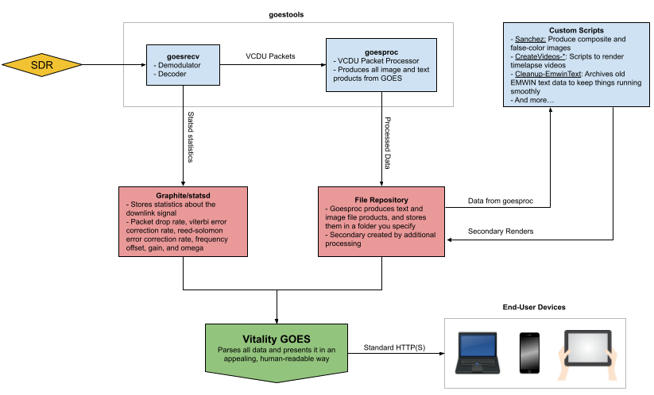
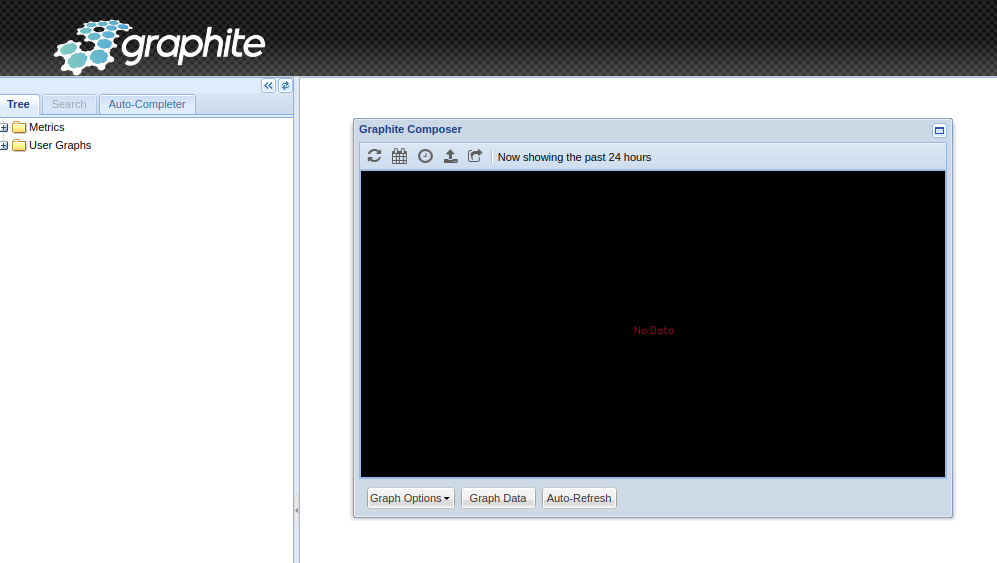

# Vitality GOES
A simple Progressive Web App for showcasing Geostationary Weather Satellite Data. The software is designed to showcase text and image received from GOES satellites via goestools, but other data sources may work.

### Table of Contents
1. [What does Vitality GOES do?](#what-does-vitality-goes-do)
2. [System Requirements](#system-requirements)
3. [Preparing your system for Vitality GOES](#preparing-your-system-for-vitality-goes)
4. [Installing Vitality GOES](#installing-vitality-goes)
5. [Configuring Vitality GOES](#configuring-vitality-goes)
6. [Additional Script Setup](#additional-script-setup)
7. [Troubleshooting](#troubleshooting)
8. [Credits](#credits)
9. [Additional Resources](#additional-resources)

## What does Vitality GOES do?

Vitality GOES makes data from the GOES HRIT/EMWIN feed easily accessible, through a web browser, from anywhere on your local network. Even if the internet goes down due to a weather emergency, people on your local LAN can still access real-time emergency weather information.

Vitality GOES has the following features:

* Once set up by the ground station technician (you!), Vitality GOES is easily usable by anyone with no knowledge of radio, satellites, or programming.
* It presents all full-disk, Level 2 products, and mesoscale imagery in a user friendly and easily navigatable way.
* Pertinent EMWIN data (which includes current weather conditions, forecasts, watches, and warnings) are presented to the user in a way that is appealing and easy to read. There is no need to parse through data for other locations: your configured location's data is the only thing you're shown.
* It is able to monitor the status of the underlying goestools stack, including systems temps, error correction rates, and packet drop rates.

### How does it work?

The following diagram shows how data flows from a GOES satellite through to Vitality GOES, and ultimately your end users:



To put it simply: goestools and secondary scripts dump data to a folder on the ground station computer. From there, Vitality GOES reads the data and presents it to the user on their device across the local network.

## System Requirements

There are different ways to set up the Vitality GOES server. It is recommended that you run Vitality GOES on your ground station itself for the most up-to-date information and to simplify setup/maintenance, but it can be run on another machine if you have a sync process set up between the ground station and the Vitality GOES server.

It is recommended that you use a Debian-based Linux distro to run the Vitality GOES server - something like Raspberry Pi OS, Ubuntu, or Debian itself. Running the server on Windows is untested, but should work.

If you enable the video rendering scripts, keep in mind that these scripts may take more power than a low-end machine, like a Raspberry Pi, can provide. You may need to offload these tasks to another machine or upgrade your server to something beefier. I'm using an old Dell Latitude laptop, which has more than enough power to run goestools and all secondary scripts.

Once configured, any modern web browser can connect to Vitality GOES and view the data.

## Preparing your system for Vitality GOES

### Graphite/statsd

Goesrecv supports logging information about error correction rate, packet drop rates, and so on to a statsd server. This information is invaluble to ground station operators, so it should be made easily accessible. This project accomplishes this by staging the information in a Graphite database, which Vitality GOES can then query and present to the user.

Configuring Graphite is not necessary to use Vitality GOES, but no graphs will be available if you don't set it up. If Vitality GOES is on a different machine from goestools, graphite/statsd can be installed on either machine. To configure graphits/statsd:

1. Install Docker on the target machine. This varies by distro, but you can find instructions for Ubuntu and its varients [here](https://docs.docker.com/engine/install/ubuntu/) and Raspberry Pi OS [here](https://dev.to/elalemanyo/how-to-install-docker-and-docker-compose-on-raspberry-pi-1mo). Docker Compose is not required.
2. As root, run the following commands to create a storage area for graphite.
    ```
    mkdir -p /var/lib/graphite/config
    mkdir -p /var/lib/graphite/data
    mkdir -p /var/lib/graphite/statsd_config
    mkdir -p /var/lib/graphite/log
    ```
3. Download graphite/statsd by running `docker pull graphiteapp/graphite-statsd`
4. Run the following command to configure graphite/statsd, start it up, and set it to start at system boot:
    ```
    docker run -d\
     --name graphite\
     --restart=always\
     -p 8080:80\
     -p 8125:8125/udp\
     -p 8126:8126\
     -v /var/lib/graphite/config:/opt/graphite/conf\
     -v /var/lib/graphite/data:/opt/graphite/storage\
     -v /var/lib/graphite/statsd_config:/opt/statsd/config\
     -v /var/lib/graphite/log:/var/log\
     graphiteapp/graphite-statsd
     ```
That's it! To verify it's working, go to http://graphitehost:8080/ and make sure you see something that looks like this:



### goestools
To assist you in configuring goestools for Vitality GOES, sample `goesrecv.conf` and `goesproc-goesr.conf` files have been included in the goestools-conf folder of this repository. These files are pretty close to "stock" suggested files. You do not need to use these exact configs. You might want to remove sections you won't be using, and you'll need do do a "Find & Replace" to update the directory to where you want your GOES products stored. In the end, your setup should be configured as follows:

* If you plan on tracking satellite decoding statistics, make sure your `goesrecv.conf` file has a `statsd_address` defined where you are hosting Graphite/statsd
* If you are going to enable EMWIN information, make sure you have the emwin handler enabled in `goesproc-goesr.conf` and it's not ignoring text files.
* In goesproc-goesr.conf, image handlers should have the filename end in `{time:%Y%m%dT%H%M%SZ}` and the file format should be jpg.

### Vitality GOES Dependencies
Vitality GOES itself is a set of PHP, HTML, JavaScript, and CSS files. As such, it needs to run on a web server stack. For this tutorial, I'm going to assume you're not running another web server on the same machine.

Assuming you're on a Debian-based server, the following commands command should install all the dependencies you need:

```
sudo apt update
sudo apt upgrade
sudo apt install apache2 php libapache2-mod-php lm-sensors
```

Afterwards, Verify your web server is working. You should see something that looks like this:

## Installing Vitality GOES

## Configuring Vitality GOES

## Additional Script Setup

A number of Bash scripts are included in the scripts directory of this repository. It is optional to implement any of these scripts, but some like Cleanup-EmwinText are highly encouraged.

## Troubleshooting

## Credits
Special thanks to [Pieter Noordhuis for his amazing goestools package](https://pietern.github.io/goestools/). Without him, Vitality GOES would be nothing, and the GOES HRIT/EMWIN feed would remain out of reach for a large number of amateur satellite operators.

The following software packages are included in Vitality GOES:
* **FontAwesome Free** ([https://fontawesome.com](https://fontawesome.com/)): made available under the Creative Commons License
* **LightGallery** ([https://www.lightgalleryjs.com](https://www.lightgalleryjs.com/)): made available under the GPLv3 License
* **OpenSans** ([https://fonts.google.com/specimen/Open+Sans](https://fonts.google.com/specimen/Open+Sans)): made available under the Apache License

An additional thank you to my parents, who changed my diaper for the first 2 years of my life. I'm now a father of two, so I realize how instrumental diaper changes were in me being able to create Vitality GOES (although a few events might have happened between...)

## Additional Resources
Here are a few tools that may help you with picking up the HRIT/EMWIN Feed

* [RTL-SDR Blog tutorial on GOES reception](https://www.rtl-sdr.com/rtl-sdr-com-goes-16-17-and-gk-2a-weather-satellite-reception-comprehensive-tutorial/): A good starting point for how to pick up geostationary weather satellites
* [USRadioGuy's GOES tutorial](https://usradioguy.com/programming-a-pi-for-goestools/): Another good tutorial to get you started with the GOES satellites
* [goesrecv-monitor](https://vksdr.com/goesrecv-monitor): goesrecv monitor is a software utility for monitoring the status of goesrecv by Pieter Noordhuis. Provides a constellation diagram of the BPSK signal along with real-time decoding statistics
* [goesrecv-ps](https://github.com/JVital2013/goesrecv-ps): a collection of PowerShell scripts for monitoring goesrecv. Contains scripts to monitor the spectrum goestools sees in real-time over RTL-TCP, monitor Virtual Channel activity, and more
